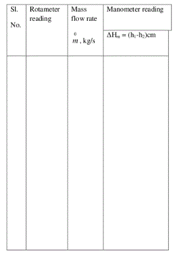
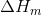
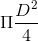
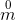
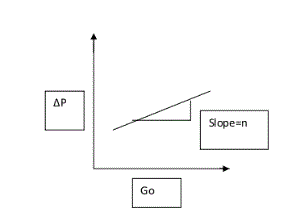
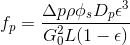
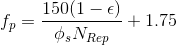
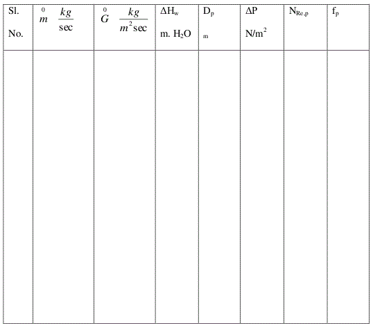

#### Apparatus required :

CCL4 manometer, Hg manometer.

#### Procedure :
<ol style="list-style-type: number; text-align: justify;">
<li>Keep the bypass valve completely open and the main valve completely closed. Switch on the pump.</li>
<li>Connect a CCL4 manometer across the packed bed. Open the main valve and allow the fluid to flow through the bed.</li>
<li> Wait till steady state is attained</li>
<li>Note down the manometer reading and the flow rate using the rotameter.</li>
<li>Increase the flow rate by opening the main valve and throttling the bypass valve suitably
and repeat steps (3) and (4).</li>
<li>Use Hg manometer at higher flow rates.</li>
<li>After completing the experiment, close the main valve. Switch off the pump. Determine
the void volume by draining water from the column. </li>
</ol>

#### Data :

Nominal pipe(column) diameter =  
Actual pipe(column) diameter = D = &nbsp;&nbsp;&nbsp;&nbsp;&nbsp;m 
Length of the packed bed = L = &nbsp;&nbsp;&nbsp;&nbsp;&nbsp;m  

Density of fluid =  = &nbsp;&nbsp;&nbsp;&nbsp;&nbsp;&nbsp;&nbsp;&nbsp;&nbsp;&nbsp;kg/m3 
Viscosity of fluid=   = &nbsp;&nbsp;&nbsp;&nbsp;&nbsp;&nbsp;&nbsp;&nbsp;&nbsp;&nbsp;cp 
Density of CCL4 = CCL4 =&nbsp;&nbsp;&nbsp;&nbsp;&nbsp;&nbsp;&nbsp;&nbsp;&nbsp; kg/m3 
Density of Hg = &nbsp;  Hg= &nbsp;&nbsp;&nbsp;&nbsp;&nbsp;&nbsp;&nbsp;&nbsp;&nbsp; kg/m3 

#### Observations :

Volume of voids = m3 
= Sphericity = 
Specific surface area = S = m2/m3= surface area/Unit bed area 

#### Calculations :

Flow rate: 
Pressure drop in cm of manometric fluid =  
Bed Porosity =  = void volume/volume of bed  

Cross sectional area of the bed = = &nbsp;&nbsp;&nbsp; m2   
Volume of bed =&nbsp;*L=m3 

Equivalent diameter of the particles, Dp=6(1-)/*S=&nbsp;&nbsp;  m 

Mass flow rate =  = Volumetric flowrate * density 

Superficial mass velocity, G0=/cross sectionalarea of tower= kg/s.m2  
 

m
and
 are density of manometric fluid and density of fluid . 
=   &nbsp;&nbsp;&nbsp;  N/m2 

Modified Reynolds number,
 
NRep=Dp*G0/
 
 = viscosity of fluid 

 
Plot  vs G0 on log - log Graph 
Find the slope = n 
Then  
Calculate Modified friction factor 
 

Verify Ergun's Equation given below 
 
 
Plot fpvs 1/NRep on an ordinary graph sheet. Find the slope and intercept.  
Check for the validity of Ergun's equation 

<table></table>

plot ftheo vs NRep on a log-log graph. 

#### Results :
Comment on effect of modified Reynolds number on modified friction factor.
Comment on effect of superficial mass velocity on process drop across the bed and report n.

