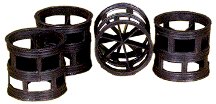
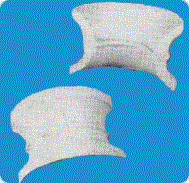
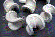

### Background and Theory

Chemical Engineering operations commonly involve the use of packed beds.
These are devices in which a large surface area of contact between a liquid and a
gas, or a solid and a gas or liquid is obtained for achieving rapid mass and heat
transfer and for chemical reactions.

Packed bed column is a cylindrical column packed with certain packing
material. The packing can be randomly filled with small objects like Raschig rings
or else it can be a specifically designed structured packing. Several chemical
engineering unit operations such as absorption, adsorption, distillation and
extraction are carried out in packed columns. These packings enhance the surface
area available for transfer operations. Packed columns are also used for
heterogeneous catalytic reactions. The packed bed configuration also facilitates the
intimate mixing of fluids with mismatched densities, largely due to increased
surface area for contact.

Flow through a packed bed can be regarded as fluid flow past some number of
submerged objects. When there is no flow through the packed bed, the net
gravitational force (including buoyancy) acts downward. When flow begins
upward, friction forces act upward and counterbalance the net gravitational force.
The frictional force can be expressed in terms of a friction factor. This leads to
equations describing the flow of a fluid past a collection of particles. From a fluid
mechanical perspective, the most important issue is that of the pressure drop
required for the liquid or the gas to flow through the column at a specified flote. The pressure losses accompanying the flow of fluids through packed columns
are caused by simultaneous kinetic and viscous energy losses. The essential factors
determining the energy loss, i.e. pressure drop, in packed beds are:

<ol style="list-style-type: number; text-align: justify;">
<li>Rate of fluid flow</li>
<li>Viscosity and density of the fluid</li>
<li>Closeness and orientation of packing</li>
<li>Size shape and surface of the particles</li>
</ol>

	The first two variables concern the fluid, while the last two the solids.
	To calculate the pressure losses, we rely on a friction factor correlation
	attributed to Ergun.

The frictional force can be expressed in terms of a friction factor. This leads
to equations describing the  flow of a fluid past a collection of particles. There
are several approaches to treating fluid flow through packed beds. The most
successful of these is the Ergun Equation, which describes flow in both the laminar
and
turbulent regimes. This method treats the packed column as a compact
irregular bundle of tubes. Modifying the theory for straight tubes not only takes into
account the irregularity of the tubes, but yields relationships similar to those
derived for straight tubes as well.

This analysis assumes several conditions. First, we assume that the particles are
packed in random; there is no channelling in the packed bed. Channelling occurs
when the fluid flowing through the packed bed finds a "preferred path" through the
bed. We also assume that the diameter of the packing is much smaller than the
diameter of the column as well. The maximum recommended particle diameter is
one-fifth of the column diameter. We assume that velocity, particle diameter and
void fraction behaves as a bulk behaviour and hence we can use an average values.
The Ergun equation is 

&nbsp;&nbsp;&nbsp;&nbsp;&nbsp;&nbsp;--------- (1)
 
fp is the friction factor for a packed bed called as modified friction factor.  
Where, 

&nbsp;&nbsp;&nbsp;&nbsp;&nbsp;&nbsp; --------- (2)
 

Where,

 = the pressure drop, 
L= the height of the bed, 
 = the fluid viscosity, 
 = the fluid viscosity, 
V0 = the fluid superficial velocity, 
Dp =the particle diameter, 
 = the density of the fluid, 
 = sphericity of the particle.</b> 

Ergun equation was obtained by fitting the data for spheres, cylinders and crushed
solids such as coke and sand. For Raschig rings and Berl saddles, which have
porosities of 0.55 to 0.75, Ergun equation predicts pressure drops lower than those
found experimentally. It also does not apply well to other tower packings of high
surface area and high porosity.

It is seen from the formula that when the flow is high, the turbulent part of the
formula appears; likewise, when the flow is low, the laminar part of the formula
comes out. Thus, the Ergun equation can be used for any type of flow. 
 
The Ergun equation tells us a number of things. It tells us the pressure drop along
the length of the packed bed given some fluid velocity. It also tells us that the
pressure drop depends on the packing size, length of bed, fluid viscosity and fluid
density.

At low Reynolds numbers, the quantity 1.75 of Eq.(1) is negligible in comparison
with Reynolds number term. This implies that the viscous forces control and that
inertial forces are unimportant. Then we have 

This is called the Kozeny-Carman equation and is a laminar flow equation, to be
used when NRep is less than about 1.For a given system it indicates that the pressure
drop is directly proportional to the flow rate.

For large Reynolds numbers, above about 1000,the first term on the right hand side
of Eq.(1) fades out as viscous forces become negligible and inertial forces control,
then

This is called Blake Plummer equation. For large Reynolds numbers, above about
1000 pressure drop is proportional to square of velocity. 
In addition to Ergus' correlation, another model, the Leva' equation is
commonly utilized in the prediction of pressure drop versus flow rate. Leva's
equation, based on the study of single incompressible fluids through an
incompressible bed of granular salts, is relatively similar to the structure of the
Ergun equation.

##### Commonly used Tower packings :

 
Raschig rings
 

 

Pall rings
 

&nbsp;&nbsp;&nbsp; 

Intalox saddles
 

 
Berl saddles

